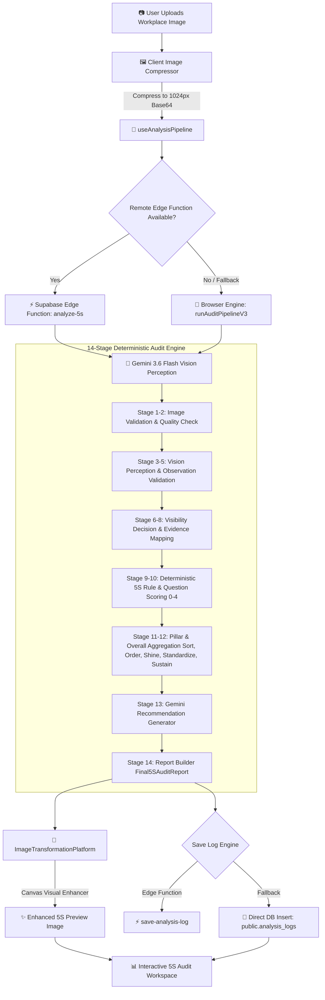
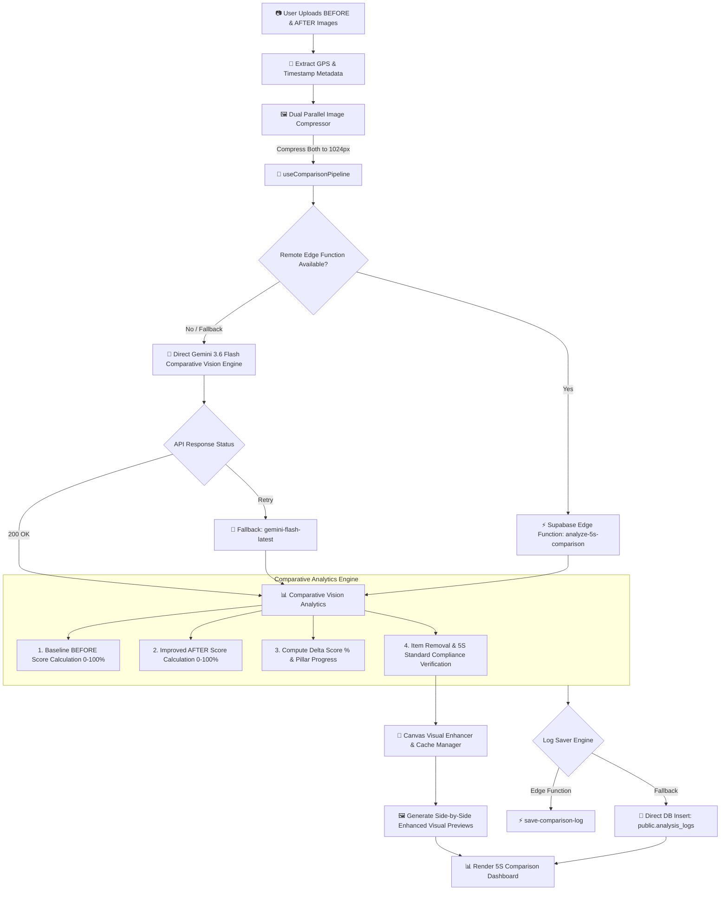

# 5S Audit & Comparison Pipeline Architecture

This document provides the complete technical architecture and Mermaid flowcharts for both the **5S Audit Module** and the **5S Comparison Module** in the Arcolab 5S Workplace Analysis Platform.

---

## 1. 📋 5S Audit Pipeline Flowchart (Single Image Analysis)

The **5S Audit Pipeline** processes a single workplace image using a 14-Stage Deterministic Engine powered by `gemini-3.6-flash`.

### Key Stages in 5S Audit Pipeline:
1. **Client Compression**: Resizes uploaded images to 1024px base64 for optimal network transmission.
2. **Dual-Path Execution**: Invokes Supabase Edge Function `analyze-5s`, or falls back to direct browser execution `runAuditPipelineV3`.
3. **Gemini 3.6 Flash Perception**: Analyzes visual workspace elements with structured JSON vision prompts.
4. **14-Stage Deterministic Scoring Engine**: Evaluates 20 standardized 5S audit questions across 5 Pillars (Sort, Set in Order, Shine, Standardize, Sustain) with numeric scores (0-4).
5. **Direct DB Fallback**: Guarantees persistence to `public.analysis_logs` in Supabase PostgreSQL even if Edge Functions are unavailable.

---

## 2. 🔄 5S Comparison Pipeline Flowchart (Before vs. After Analysis)

The **5S Comparison Pipeline** evaluates Before & After workplace images, calculating improvement deltas, progress metrics, and side-by-side visual diffs.

### Key Stages in 5S Comparison Pipeline:
1. **Parallel Compression**: Compresses both Before and After images simultaneously.
2. **Comparative Vision Engine**: Executes `gemini-3.6-flash` (with `gemini-flash-latest` fallback) to analyze visual differences.
3. **Delta Score Engine**: Computes exact percentage gains per pillar and overall workspace improvement.
4. **Visual Previews**: Generates enhanced visual side-by-side previews with duration caching.
5. **Database Persistence**: Stores logs in `public.analysis_logs` with before/after images, delta scores, GPS coordinates, and employee IDs.

---

## 3. 📊 Module Technical Comparison

| Feature | 📋 5S Audit Pipeline | 🔄 5S Comparison Pipeline |
| :--- | :--- | :--- |
| **Input** | Single Workplace Image | Before Image + After Image + GPS Metadata |
| **Primary AI Model** | `gemini-3.6-flash` | `gemini-3.6-flash` |
| **Fallback AI Model** | `gemini-flash-latest` | `gemini-flash-latest` |
| **Execution Engine** | 14-Stage Deterministic Audit Pipeline | Dual Image Comparative Vision Engine |
| **Scoring Output** | Overall score (0–100%), Grade (A–F), 5 Pillar Scores, Question-by-Question breakdown | Before Score, After Score, Delta Improvement %, Item Movement Log |
| **Visual Enhancement** | Canvas 5S Visual Enhancer (Single Image) | Canvas Dual Comparison Visual Enhancer |
| **DB Table** | `public.analysis_logs` | `public.analysis_logs` (with before/after payload) |
