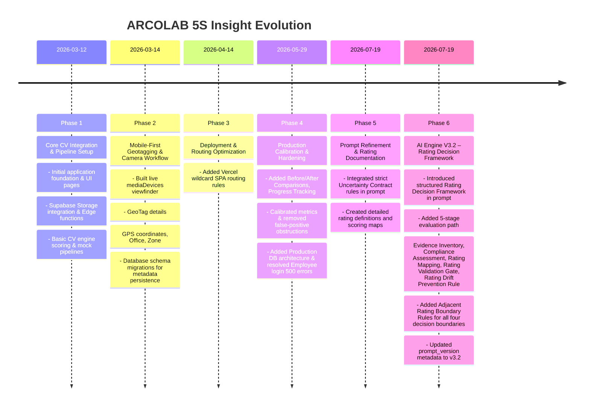

# ARCOLAB 5S Insight - Project Update History & Phase Record

This document provides a chronological record of development phases, key updates, and architecture evolution for the ARCOLAB 5S Insight application.

---

## 📈 Summary of Development Phases

---

## 📂 Detailed Phase Chronology

### 🔹 Phase 1: CV Engine Integration & Pipeline Setup (March 12, 2026)
* **Goal**: Establish the primary workspace foundation and hook up initial API contracts.
* **Commit Reference**: `a598416`
* **Key Achievements & Deliverables**:
  * **Application Core**: Configured React, TypeScript, Vite, TailwindCSS, and shadcn/ui boilerplate.
  * **User Interfaces**: Created landing page, 5S Analysis capture dashboard, History logs viewer, Lean Maintenance info pages, and User Profiles.
  * **Serverless Backend**: Programmed initial Deno-based Supabase Edge Functions:
    * `analyze-5s`: Interfaces with the computer vision engine.
    * `employee-login`: Resolves staff IDs and handles sessions.
    * `save-analysis-log`: Stores raw scoring outputs into the database.
  * **Database Architecture**: Implemented base SQL schemas establishing storage buckets, users, and audit log structures.

---

### 🔹 Phase 2: Mobile-First Geotagging & Camera Viewfinder (March 14 - 16, 2026)
* **Goal**: Enable direct field captures from mobile cameras, gathering precise metadata (GPS coordinates, offices, and zones) to ensure audit accountability.
* **Commit References**: `2d1ed01`, `391a464`, `fbd24d9`, `7fed725`, `6738d65`
* **Key Achievements & Deliverables**:
  * **Interactive Camera**: Rebuilt the `ImageUploader` component with an active camera viewfinder via `navigator.mediaDevices.getUserMedia`.
  * **Metadata Collection**:
    * Structured a **GeoTag Details** card capturing exact latitude/longitude coordinates, employee ID, designated office location, specific zone, and timestamps.
    * Added a floating overlay to quickly download captured frames locally.
  * **Database Schema Extension**: Added migration `20260314001935_add_geotag_columns.sql` adding `latitude`, `longitude`, `office_id`, `zone`, and `employee_id` attributes to persistent logs.
  * **Resilience Fixes**:
    * Fixed mobile Chrome failure points in non-HTTPS (insecure context) scenarios by providing graceful image file upload fallbacks.
    * Decoupled GPS loading using background worker execution to prevent camera feed freezes.
    * Added guest credential testing profile `ARC102`.

---

### 🔹 Phase 3: Deployment Routing Optimization (April 14, 2026)
* **Goal**: Resolve hydration and client routing issues post-deployment.
* **Commit Reference**: `5d17d07`
* **Key Achievements & Deliverables**:
  * **Vercel Config**: Created `vercel.json` rewrite profiles and a fallback `/public/_redirects` rule to direct all sub-paths back to the client-side SPA router, preventing hard `404 Not Found` responses on page refresh.

---

### 🔹 Phase 4: Production Hardening & Advanced Metrics Calibration (May 29, 2026)
* **Goal**: Deliver precise score calibrations, rich UX features, and fix enterprise auth schema bottlenecks.
* **Commit References**: `d9c531e`, `7c5c83a`, `cf4dbe1`
* **Key Achievements & Deliverables**:
  * **UX Upgrade**: Added advanced feedback modules:
    * `BeforeAfterComparison`: Visual slider contrasting the audited space against baseline standard workspace conditions.
    * `AnalysisProgress`: Informative loader showing steps (Uploading image, Performing CV check, Validating compliance, Saving results).
    * `ScoreExplanationCard`: Breaks down 5S scores (Sort, Set in Order, Shine, Standardize, Sustain) with dynamic contextual advice.
  * **CV Calibrations**: Fine-tuned scoring thresholds to eliminate false-positive obstruction detections, improving precision.
  * **Database Architecture Migration**: Executed `20260521210500_production_database_architecture.sql` to optimize office mappings and scale table relationships for production.
  * **Critical Bug Fixes**:
    * Resolved an **HTTP 500 error** in the `employee-login` edge function originating from a schema mismatch during table queries.
    * Standardized the API communication hook `useAnalysisPipeline` to handle state transitions smoothly.
    * Created `deterministic.test.ts` to ensure consistent execution.

---

### 🔹 Phase 5: Prompt Refinement & Rating Documentation (July 19, 2026)
* **Goal**: Establish strict Uncertainty Contract behavior in the Gemini prompt and compile comprehensive rating and scoring logic documentation.
* **Commit Reference**: `d6df0d8`
* **Key Achievements & Deliverables**:
  * **Prompt Refinement (Uncertainty Contract)**: Programmed strict average rating fallback rules when visual evidence is insufficient, preventing descriptive variance or overrides.
  * **Rating Definitions**: Created [rating_definitions.md](file:///c:/Users/Vijay%20Ramesh/5S/basics/rating_definitions.md) documenting VERY_GOOD, GOOD, AVERAGE, BAD, and VERY_BAD ratings, compliance answer mappings, and evidence consistency controls.
  * **Scoring Mapping**: Created [scoring_mapping.md](file:///c:/Users/Vijay%20Ramesh/5S/basics/scoring_mapping.md) documenting scoring conversions, pillar score calculations, overall score formulas, and grade/color thresholds.

---

### 🔹 Phase 6: AI Engine V3.2 – Rating Decision Framework (July 19, 2026)
* **Goal**: Upgrade the ARCOLAB AI Engine from V3.1.1 to V3.2 by introducing a structured Rating Decision Framework to reduce rating inconsistency on identical or near-identical workplace evidence.
* **Key Achievements & Deliverables**:
  * **Rating Decision Framework**: Inserted a structured 5-stage reasoning path into the Gemini prompt that the model must complete before assigning any rating for State 1 or State 2 evaluations:
    * **Stage 1 – Evidence Inventory**: Internal classification of all visible evidence into Positive and Negative categories (never surfaces in JSON output).
    * **Stage 2 – Compliance Assessment**: Overall compliance state selection from five defined states (Fully Compliant → Critically Non-Compliant), explicitly prohibiting count-based rating decisions.
    * **Stage 3 – Rating Mapping**: Deterministic fixed mapping from Compliance State to rating (no alternative mappings permitted).
    * **Stage 4 – Rating Validation Gate**: Four-step pre-output validation ensuring rating–evidence consistency and preventing adjacent rating misclassification.
    * **Stage 5 – Rating Drift Prevention Rule**: Final consistency safeguard ensuring equivalent Evidence Inventories and Compliance Assessments always produce the same rating across repeated executions.
  * **Adjacent Rating Boundary Rules**: Introduced explicit decision boundary definitions for all four adjacent rating pairs (VERY_GOOD/GOOD, GOOD/AVERAGE, AVERAGE/BAD, BAD/VERY_BAD).
  * **Prompt Version Metadata**: Updated `prompt_version` from `"v2.0"` to `"v3.2"` in `buildResult()` for production traceability and regression tracking.
  * **Architecture Preservation**: Zero changes to the AI pipeline, Gemini API integration, Edge Function handler, JSON schema, response parser, validator, deterministic scoring, questionnaire definitions, Visibility Decision Rule, Uncertainty Contract, Immutable Uncertainty Contract Rule, recommendation generation, report generation, or PDF generation.
